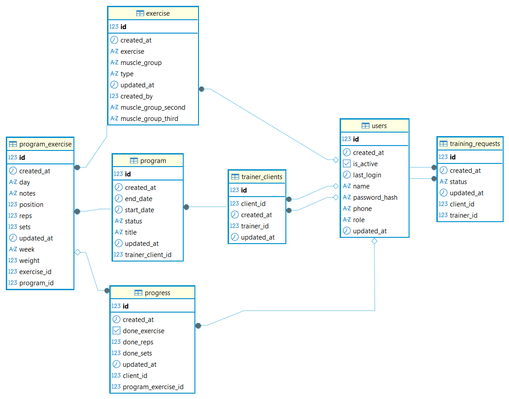

### Database Structure
#### ER Diagram

---
#### Users
The `users` table stores both trainers and clients.

**Key fields:**  
- id – primary key  
- phone – unique identifier for login  
- name – user name (login)  
- role – `TRAINER` or `CLIENT`  
- passwordHash – encrypted password  
- isActive – account status  
- createdAt, updatedAt – timestamps  

**Relations:**
- One user can be a trainer or a client
- Connected to training requests and training relationships

---

#### Trainer–Client Relationship
`training_requests`  
Used to manage connection requests between users.  

Stores requests from clients to trainers.  
- trainer_id → User
- client_id → User
- status → `PENDING` / `ACCEPTED` / `REJECTED`
- createdAt, updatedAt

`trainer_clients`  
Represents an active relationship between trainer and client (after acceptance).  

- trainer_id → User
- client_id → User
- createdAt

Each pair represents an active coaching relationship.

---

#### Exercises
Stores all available exercises.

`exercise`  
- id
- name
- muscleGroup, muscleGroupSecond, muscleGroupThird `CHEST`, `BACK`, `LEGS`, `SHOULDERS`, ets.
- type `STANDARD`, `CUSTOM`
- createdBy → User (trainer who created it)
- createdAt, updatedAt

---

#### Training Programs
Represents a training plan assigned to a client via a trainer-client relationship.  

**`program`**
- id
- trainer_client_id → `TrainerClient`
- title
- status → `DRAFT` / `SENT`, / `FINISHED`, / `ARCHIVED`
- createdAt, updatedAt
 
**Relations:**
One Program → many `program_week`

**`program_week`**
- id (PK)
- program_id (FK)
- title
- position (ordering)

**Relations:**
One Week → many `program_day`

**`program_day`**
- id (PK)
- program_week_id (FK)
- day (MONDAY–SUNDAY enum)
- position (ordering)

**Relations:**
One Day → many `program_xercise`

**`program_exercise`**  
Join table between program and exercise.

- id (PK)
- program_day_id (FK)
- exercise_id (FK)
- position (ordering inside day)
- weight
- sets
- reps
- notes
- createdAt, updatedAt

**Indexes:**
program_day_id
exercise_id
program_day_id + position

---

#### Progress Tracking
`progress`  
Stores client performance data.

- id
- program_exercise_id
- client_id
- doneExercise
- doneSets, doneReps
- createdAt, updatedAt

Used to track completed workouts and performance history.

---

**Relationships Summary**  
- User ↔ TrainingRequest (sent/received)
- User ↔ TrainerClient (trainer-client connection)
- TrainerClient → Program
- Program → ProgramExercise → Exercise
- ProgramExercise → Progress (client tracking)

**Design Notes**  
- All relationships are implemented using `@ManyToOne` for simplicity and performance.
- `TrainerClient` acts as the central link between users and programs.
- `ProgramExercise` is the core scheduling entity for workouts.
- `Progress` tracking is separated to keep historical data immutable.
